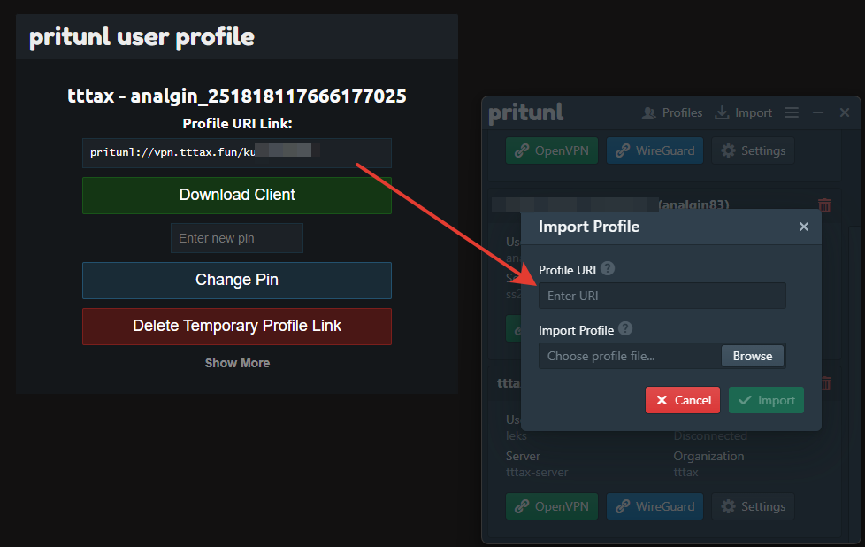
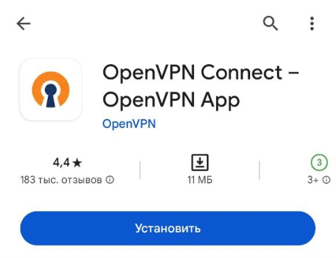
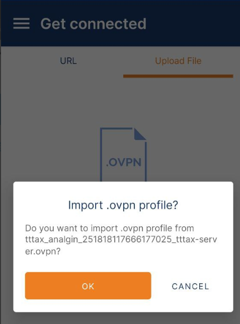

# Инструкция к Pritunl VPN для всех платформ
### Выберите платформу:
- [Windows](#windows)
- [Linux](#linux)
- [Mac OS](#mac-os)
- [Android](#android)
- [iOS](#ios)

## Windows
1. Скачайте **Pritunl Client** для Windows [с официального сайта](https://client.pritunl.com/#install) (внизу справа) и установите его.
2. Скачайте и установите [драйвер **Wireguard**](https://www.wireguard.com/install/) для высокой скорости VPN.
3. Перезагрузите ПК, чтобы драйвер заработал.
4. Получите от **discord-бота** ссылку на ваш профиль с помощью команды **/vpn**.
5. Перейдите по ссылке на профиль от бота и скопируйте адрес из поля **Profile URI Link**. В Pritunl-клиенте нажмите **Import**, вставьте в поле **Profile URI** скопированный адрес и нажмите Import.

6. Готово. Теперь можно подключаться и отключаться к VPN используя кнопку **Wireguard** (или OpenVPN - более низкая скорость) в клиенте. Подключение установлено, если в поле Client Adress появился адрес. Если имеется только кнопка Connect, значит драйвер Wireguard не установлен.

## Linux
1. Скачайте и установите **Pritunl Client** для вашего дистрибутива согласно руководству [с официального сайта](https://client.pritunl.com/) (внизу страницы).
Примечание: Для установки на более старые версии дистрибутивов, например на Ubuntu 22.04 можно воспользоваться пакетами .deb/.rpm с прошлыми версиями "pritunl-client-electron", например, отсюда https://github.com/pritunl/pritunl-client-electron/releases/tag/1.3.3782.35. В этом случае не обновляйте клиент после установки.
2. Скачайте и установите [драйвер **Wireguard**](https://www.wireguard.com/install/) для более высокой скорости подключения.
3. Получите от **discord-бота** ссылку на ваш профиль с помощью команды **/vpn**.
4. Перейдите по ссылке на профиль от бота и скопируйте адрес из поля **Profile URI Link**. В Pritunl-клиенте нажмите **Import**, вставьте в поле **Profile URI** скопированный адрес и нажмите Import.

5. Готово. Теперь можно подключаться и отключаться к VPN используя кнопку **Wireguard** (или OpenVPN - более низкая скорость) в клиенте. Подключение установлено, если в поле Client Adress появился адрес. Если имеется только кнопка Connect, значит драйвер Wireguard не установлен.

## Mac OS
1. Скачайте **Pritunl Client** для MacOS [с официального сайта](https://client.pritunl.com/) (внизу страницы, слева) и установите его.
2. Скачайте и установите [драйвер **Wireguard**](https://www.wireguard.com/install/) для более высокой скорости подключения.
3. Получите от **discord-бота** ссылку на ваш профиль с помощью команды **/vpn**.
4. Перейдите по ссылке на профиль от бота и скопируйте адрес из поля **Profile URI Link**. В Pritunl-клиенте нажмите **Import**, вставьте в поле **Profile URI** скопированный адрес и нажмите Import.

5. Готово. Теперь можно подключаться и отключаться к VPN используя кнопку **Wireguard** (или OpenVPN - более низкая скорость) в клиенте. Подключение установлено, если в поле Client Adress появился адрес. Если имеется только кнопка Connect, значит драйвер Wireguard не установлен.

## Android
1. Установите приложение [**OpenVPN Connect**](https://play.google.com/store/apps/details?id=net.openvpn.openvpn) из Google Play.

2. Получите от **discord-бота** ссылку на ваш профиль с помощью команды **/vpn**.
3. Перейдите по ссылке на профиль от бота и нажмите **Download Profile (tttax-server)**. Если такого пункта нет, проверьте раздел **Show more**. Будет скачан файл с профилем OpenVPN.
4. В приложении **OpenVpn Connect** перейдите в раздел **Upload File** -> **Browse** и выберите скачанный файл.
 
 

5. Готово. Теперь можно подключать и отключать VPN через приложение **OpenVPN Connect**.

## iOS
1. Установите приложение [**OpenVPN Connect**](https://apps.apple.com/app/id590379981) из App Store.
2. Получите от **discord-бота** ссылку на ваш профиль с помощью команды **/vpn**.
3. Перейдите по ссылке на профиль от бота и нажмите **Download Profile (tttax-server)**. Если такого пункта нет, проверьте раздел **Show more**. Будет скачан файл с профилем OpenVPN.
4. В приложении **OpenVpn Connect** перейдите в раздел **Upload File** -> **Browse** и выберите скачанный файл.
5. Готово. Теперь можно подключать и отключать VPN через приложение **OpenVPN Connect**.
